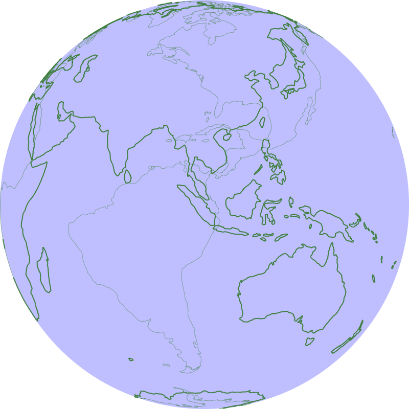

# Globe

## About

An implementation of a rotating globe in [**Rust**][1] [**WebAssembly**][2].



Data sourced from [Natural Earth][3] is transformed into code using a
[build script](./build.rs).

## Prerequisites

```sh
cargo install wasm-bindgen-cli
```

## Build

```sh
cargo build --target=wasm32-unknown-unknown --release
wasm-bindgen --target web --out-dir ./pkg ./target/wasm32-unknown-unknown/release/wasm_globe.wasm
```

## Run

Some options to serve the application include:
```sh
# Python 3.x
python3 -m http.server
# Python 2.x
python2 -m SimpleHTTPServer
# JDK 18 or later
jwebserver
```

Access via a web browser at [http://localhost:8000](http://localhost:8000).

[1]: https://rust-lang.org/
[2]: https://webassembly.org/
[3]: https://www.naturalearthdata.com/
