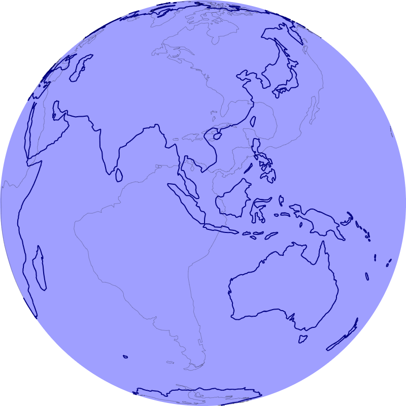

# Globe

## About

An implementation of a rotatable globe in Rust WebAssembly.



Data sourced from [Natural Earth](https://www.naturalearthdata.com/) is transformed into Rust code during compilation using a [build script](./build.rs).

## Prerequisites

Install [wasm-pack](https://github.com/rustwasm/wasm-pack).

## Compile

```bash
wasm-pack build --target web
```
or optimised for release
```bash
wasm-pack build --target web --release
```

## Serve and run

```bash
# Python 2.x
python -m SimpleHTTPServer
# Python 3.x
python3 -m http.server
```

Run in a browser at [http://localhost:8000](http://localhost:8000).
